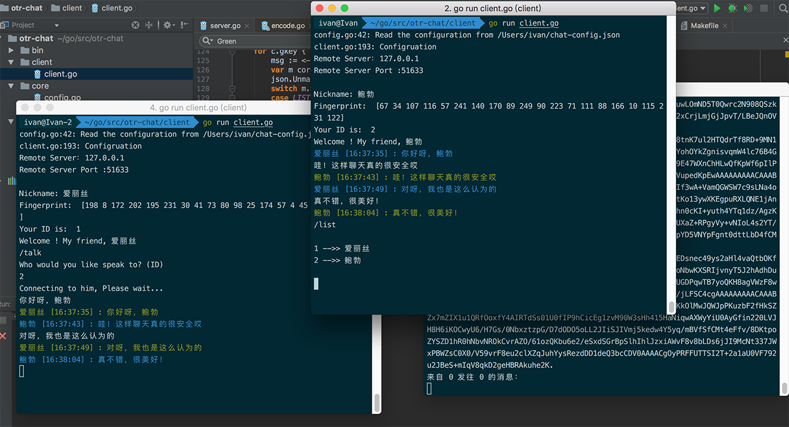
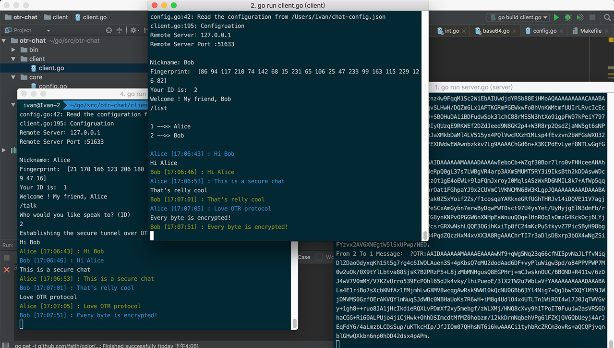
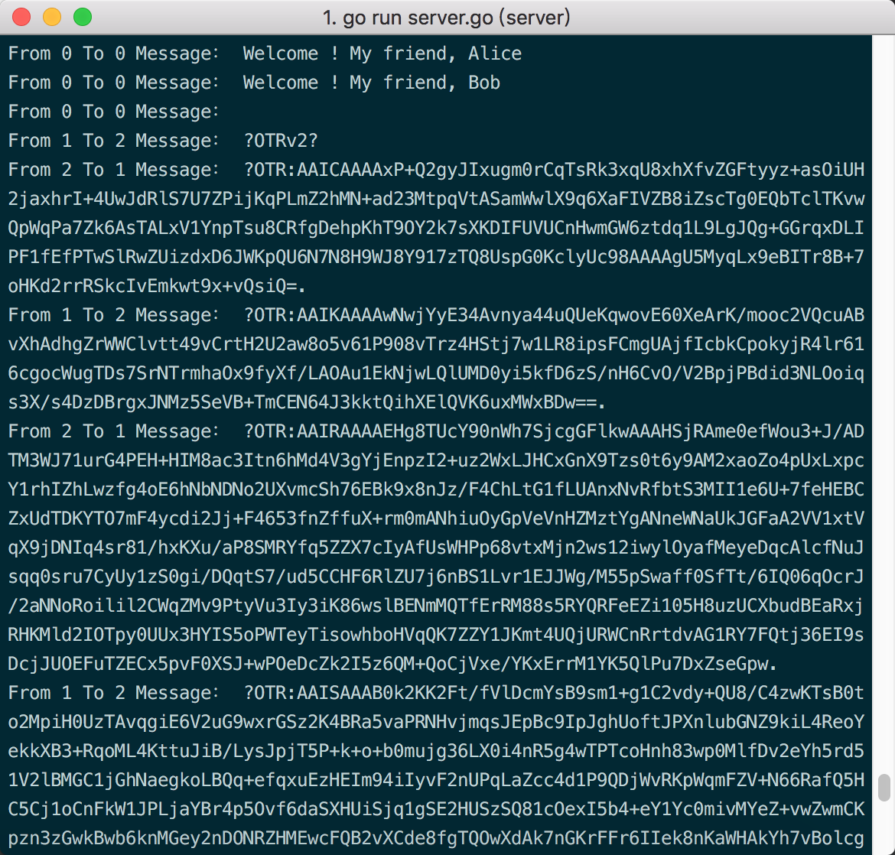

# OTR 加密聊天

一个基于OTR协议的端对端加密聊天软件，尚存bug，请谨慎阅读与使用。

# 语言

* Golang 

## 功能

- [x] UDP协议通信
- [x] Json格式通信
- [x] 客户端/服务器读取本地配置文件
- [x] 基于OTR协议的端对端加密

## 不留记录即时通讯(OTR) 协议

不留记录即时通讯（Off-the-Record Messaging，缩写为OTR）是一种安全协议，为即时通讯提供加密保护。OTR使用128bit长度的高级加密标准（AES）对称密钥加密保护，1536bits的迪菲－赫尔曼密钥交换（D-H）与SHA-1函数。在加密与验证机制之外，OTR同时提供前向保密（Forward secrecy）功能。

关于OTR协议，欢迎到我的[文章](http://blog.yfgeek.com/2016/12/06/OTR%E6%8A%80%E6%9C%AF%E6%8E%A2%E8%AE%A8/)了解更多。

## Snapshots








## 客户端

配置文件位于`~\chat-config.json`

例子
```json
{
	"listen": ":52915",
	"remote": "127.0.0.1",
	"key": "AzonXhdbWCYoAA52GTE9FnldZEN4KhEsInFJe1oHYAgzQTRsCyEdUlBOPzd3HxgFbTAudDZobiU8TQYbURBFWVdvMisNSn5UIw8kei0gcjl1cGkeFTV9U0tEY2YaCkdPYl9nZRQSBGsMQgFzVlxhL0hGAlV/O0A+OGoJfBwpE0w="
}
```
启动客户端后需要配置用户id和昵称

``
./client
``

## 服务端

配置文件位于`~\chat-config.json`

例子
```json
{
	"listen": ":52915",
	"remote": "", //随意可不填
	"key": "AzonXhdbWCYoAA52GTE9FnldZEN4KhEsInFJe1oHYAgzQTRsCyEdUlBOPzd3HxgFbTAudDZobiU8TQYbURBFWVdvMisNSn5UIw8kei0gcjl1cGkeFTV9U0tEY2YaCkdPYl9nZRQSBGsMQgFzVlxhL0hGAlV/O0A+OGoJfBwpE0w="
}
```

``
./server
``


## 参考

[https://github.com/digitalis-io/golang-udp-chat](https://github.com/digitalis-io/golang-udp-chat)

[https://github.com/gwuhaolin/lightsocks](https://github.com/gwuhaolin/lightsocks)
